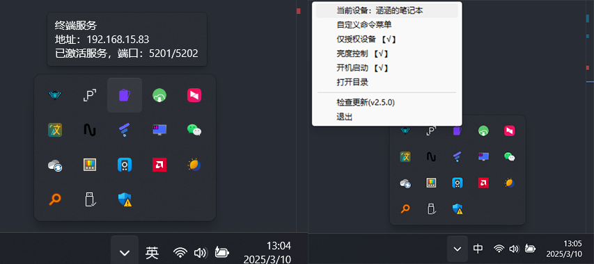
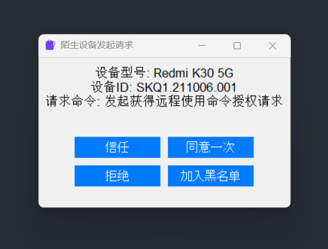

# 涵涵的超级控制终端   
一个 **局域网的懒人快捷操控执行远程命令助手**    
最新代码依据 github[https://github.com/lanzeweie/HanHan_terminal](https://github.com/lanzeweie/HanHan_terminal)         
设计的理由也很简单，"懒😊"
由于移动端确实非常方便，简简单单的交互就可以了，所以因为 "懒" 诞生了此项目。 支持设备验证哦，安全不会遭受攻击。    
当前项目是 服务端   
**移动端：**  [涵涵的超级控制面板——客户端(安卓移动端)](https://github.com/lanzeweie/HanHan)    

## 简介
仅支持 Windows10|11|Server   
此项目是服务端终端用于创建终端服务，接受客户端(安卓移动端)的命令，对接客户端(安卓移动端)面板  
**设计方法：** 使用 服务端创建API服务，客户端(安卓移动端)来访问API进行交互，以此快捷执行命令   
**功能概述：** 可以自定义执行cmd命令，自定义执行其他API链接(支持Get、Post)，内置音量跟亮度的控制    
只会显示在右下角小任务栏，静默运行  

## 使用截图

## 使用方法 
**Windows 10|11|server**  
下载发布的稳定版本  [稳定版下载](https://github.com/lanzeweie/HanHan_terminal/releases/latest)   

很简约的一个小软件，绿色软件无安装包，下载后是一个压缩包，解压到`你想存放它的目录`后再运行  
(不要在压缩包中运行！！！！！！！)     

解压到目录-启动 `ZDserver.exe`    

使用移动端 `APP (涵涵的超级控制面板)` 搜索当前设备然后进行配对  
如果需要添加自定义命令 在右下角小任务栏中选择   `自定义命令菜单` 进行编辑  
也可以直接在  [`data\orderlist.json`](./data/orderlist.json)  进行编辑   
(注意：对于自定义命令，记得在命令前方添加 `"cmd.exe /c 你的命令"`) 
 
 **可选功能**：开机启动、亮度控制（需要显示屏支持）、关闭仅授权设备  

## 开发人员
**安装库**    
`pip install -r requirements.txt -i https://pypi.tuna.tsinghua.edu.cn/simple`

**启动**      请先用终端进入当前目录   
默认使用 端口 _5201_ 与 _5202_   
端口 _5201_ 用于被移动端发现  _5202_ 用于开放API服务  
5201为UDP
`python ZDserver.py`  

在右下角小任务栏找到此程序右键操作即可  

**注意**    
在小任务栏程序右键选项快捷编辑命令，只能打开 Custom_command_editor.py已经打包成Custom_command_editor.exe   
可以选则手动启动   
`python ./app/Custom_command_editor.py`     

## 注意事项      
此控制终端需要对应的客户端(安卓移动端)支持  
[涵涵的超级控制面板——客户端(安卓移动端)](https://github.com/lanzeweie/HanHan)   

 
## 项目目录结构
./涵涵的超级控制终端    
├── data/                 --数据    
│   ├── orderlist.json    --功能配置     
│   ├── zhou.png          --图标  
│   └── Devices.json      --设备验证    
├── log/                  --日志    
│   └── last.log          --当前日志，会自动打包上一次的日志     
├── app/                  --一些可用上的辅助程序         
│   └── Custom_command_editor.py          --快捷命令菜单编辑器      
├── COM/                  --COM线锁多线程         
│   ├── com_protection_system.py      --全面的COM崩溃防护系统  
│   └── com_worker_isolated.py    --COM操作工作进程    
├── requirements.txt      --所需库      
├── REMDAD.md     
├── WinDC.py              --底层基层命令    
├── ZDserver.py           --服务端主程序          
├── WinTaskbar.py         --在Windows的小任务栏-由主程序调用    
├── .gitignore   

## 打包
nuitka --standalone --onefile --windows-console-mode=disable --windows-icon-from-ico=./data/zhou.ico --product-name="涵涵终端" --file-version="2.1.0" --company-name="lanzeweie" --file-description="涵涵的超级控制终端" --copyright="lanzeweie@foxmail.com" --main="./ZDserver.py" --output-filename=ZDserver --enable-plugins="anti-bloat" --enable-plugin=tk-inter

nuitka --standalone --onefile --windows-console-mode=disable --windows-icon-from-ico=./1.ico --product-name="涵涵终端" --file-version="1.5.0" --company-name="lanzeweie" --file-description="自定义命令菜单编辑器" --copyright="lanzeweie@foxmail.com" --main="./Custom_command_editor.py" --output-filename=Custom_command_editor --enable-plugins="anti-bloat" --enable-plugin=tk-inter --include-data-files=./1.ico=1.ico

